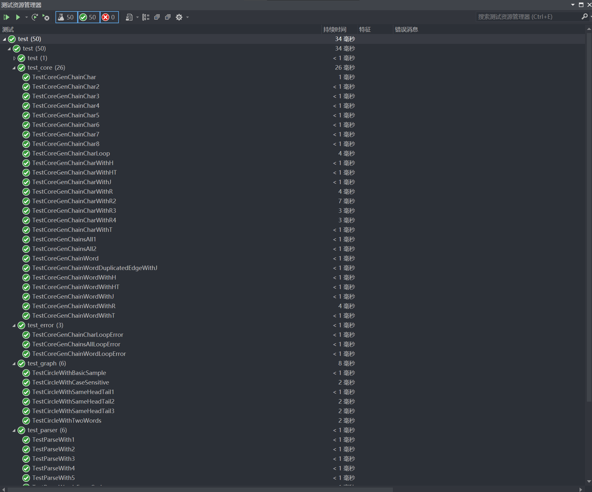
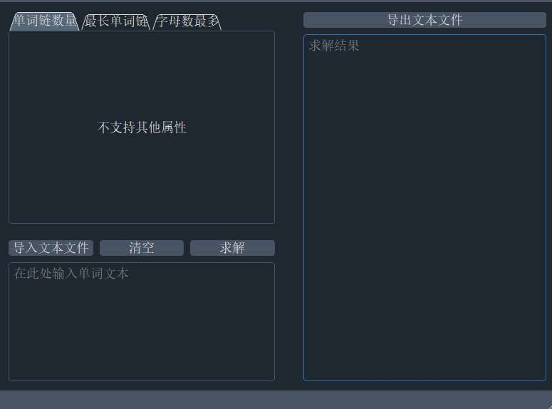
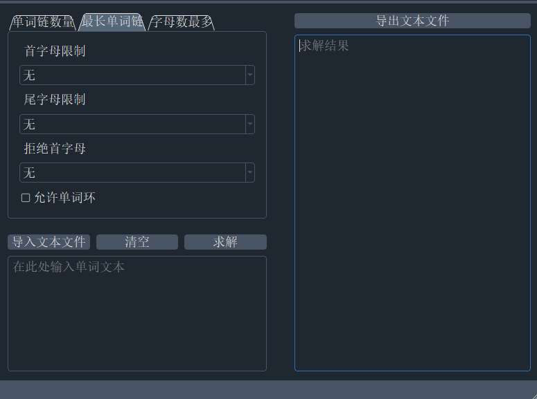

# BUAA-2023-SE-PP

| 项目                                 | 内容                                                 |
| ------------------------------------ | ---------------------------------------------------- |
| 这个作业属于哪个课程                 | [课程社区](https://bbs.csdn.net/forums/buaa-ase2023) |
| 这个作业的要求在哪里                 | [作业要求](https://bbs.csdn.net/topics/613883108)    |
| 我在这个课程的目标是                 |                                                      |
| 这个作业在哪个具体方面帮助我实现目标 |                                                      |

## 1 项目地址

教学班级：周四班

项目地址：https://github.com/CoolColoury/BUAA-2023-SE-PP/

## 2 PSP表格——预估

略

## 3 接口设计思想使用

### 3.1 Information Hiding

略

### 3.2 Interface Design

略

### 3.3 Loose Coupling

略

## 4 计算模块接口的设计与实现过程


## 5 编译通过无警告截图


## 6 UML

略

## 7 计算模块接口部分的性能改进

## 8 契约相关

略

## 9 计算模块部分单元测试展示

主要是对题目样例以及一些小样例进行测试，同时尽可能提高代码覆盖率。

### 9.1 手工样例测试

自己构造的简单样例，主要进行各个重要模块的覆盖率和正确性测试。构造了50个左右的单元测试用例。

如图所示：



所测出的代码覆盖率如下：

// 图

各个单元测试分别如下：

* `test_core`: 测试core模块的三个重要函数的功能。

    这里以`gen_chain_word`测试为例。

    首先定义一个`test_gen_chain_word`方法。为测试`gen_chain_word`的接口，并和手动构造的数据的答案进行比对判断。

    ```cpp
    void test_gen_chain_word(const char* words[], int len, const char* ans[], int ans_len, char head, char tail, char n_head, bool enable_loop) {
        char** result = (char**)malloc(10000);
        int out_len = gen_chain_word(words, len, result, head, tail, n_head, enable_loop);
        Assert::IsTrue(check_valid(result, out_len, head, tail, n_head, enable_loop));
        Assert::AreEqual(ans_len, out_len);
        free(result);
    }
    ```

    通过手动构造可以得到如下的部分测试样例：

    ```cpp
    // '-w'
    TEST_METHOD(TestCoreGenChainWord) {
        const char* words[] = { "algebra", "apple", "zoo", "elephant", "under", "fox", "dog", "moon", "leaf", "trick", "pseudopseudohypoparathyroidism" };
        const char* ans[] = { "algebra", "apple", "elephant", "trick" };
        test_gen_chain_word(words, 11, ans, 4, 0, 0, 0, false);
    }
    
    // '-h'
    TEST_METHOD(TestCoreGenChainWordWithH) {
        const char* words[] = { "algebra", "apple", "zoo", "elephant", "under", "fox", "dog", "moon", "leaf", "trick", "pseudopseudohypoparathyroidism" };
        const char* ans[] = { "elephant", "trick" };
        test_gen_chain_word(words, 11, ans, 2, 'e', 0, 0, false);
    }
    
    // ...
    ```

* `test_error`:运行时异常处理的单元测试。

    测试样例部分如下：

    ```cpp
    // 有环
    TEST_METHOD(TestCoreGenChainCharLoopError)
    {
        const char* words[] = { "element", "te", "eee", "ttt", "talk" };
        const char* ans[] = { 0 };
        try
        {
            test_gen_chain_char(words, 5, ans, 0, 0, 0, 'e', false);
        }
        catch (const std::exception&)
        {
            char* error = get_error_message();
            Assert::AreEqual(strcmp(get_error_message(), "Ring Check Exception: there is a loop in words"), 0);
        }
    }
    
    // 无环
    TEST_METHOD(TestCoreGenChainWordLoopError)
    {
        const char* words[] = { "element", "te", "eee", "ttt", "talk" };
        const char* ans[] = { 0 };
        try
        {
            test_gen_chain_word(words, 5, ans, 0, 0, 0, 'e', false);
        }
        catch (const std::exception&)
        {
            char* error = get_error_message();
            Assert::AreEqual(strcmp(get_error_message(), "Ring Check Exception: there is a loop in words"), 0);
        }
    }
    ```

* `test_graph`:数据结构（图）的核心函数的单元测试模块。

    测试样例部分如下：

    ```cpp
    // 含环测试
    TEST_METHOD(TestCircleWithTwoWords)
    {
        std::vector<std::string> words = { "ab", "ba" };
        Config c;
        c.enable_loop = true;
        c.type = 'n';
        WordGraph g(words, c);
        Assert::AreEqual(g.contain_circle(), true);
    }
    
    // 自环测试
    TEST_METHOD(TestCircleWithSameHeadTail1)
    {
        Config c;
        c.type = 'n';
        std::vector<std::string> words = { "aa" };
        WordGraph g(words, c);
        Assert::AreEqual(g.contain_circle(), false);
    }
    ```

* `test_parser`:Parser模块的单元测试。

    首先定义config检测函数:

    ```cpp
    void test_config(Config& config, char head, char tail, char n_head, char type, bool enable_loop)
    {
        Assert::AreEqual(config.head == head, true);
        Assert::AreEqual(config.tail == tail, true);
        Assert::AreEqual(config.n_head == n_head, true);
        Assert::AreEqual(config.type == type, true);
        Assert::AreEqual(config.enable_loop, enable_loop);
    }
    ```

    测试样例部分如下：

    ```cpp
    // -n
    TEST_METHOD(TestParseWith1)
    {
        Parser parser;
        int argc = 2;
        char* argv[] = { "-n", "stdin.txt" };
        parser.parse(argc, argv);
        test_config(parser.get_config(), 0, 0, 0, 'n', false);
    }
    
    // -c -j
    TEST_METHOD(TestParseWith2)
    {
        Parser parser;
        int argc = 4;
        char* argv[] = { "-c", "stdin.txt", "-j", "h"};
        parser.parse(argc, argv);
        test_config(parser.get_config(), 0, 0, 'h', 'c', false);
    }
    ```

* `test_parser_error`:Parser异常单元测试

    ```cpp
     // 缺少参数异常
     TEST_METHOD(TestMissingArgument)
    {
        Parser parser;
        int argc = 0;
        char* argv[] = { "" };
        try
        {
            parser.parse(argc, argv);
        }
        catch (const std::exception& e)
        {
            Assert::AreEqual(strcmp(e.what(), "Missing Argument: no valid argument"), 0);
        }
    }
    
    // ...详见 Part 10
    ```

    

### 9.2 对拍测试

// TODO \楠神加油!/

## 10 计算模块部分异常处理说明

我们总共定义了两种异常大类，利用了`std`的`logic_error`和自己定义的继承于`std`的`exception`。大致分别区分解析处理异常和运行时异常。

### 10.1 解析处理异常

* `Conflicted Arguemnt`:参数冲突

    ```cpp
    // -r -r 冲突
    TEST_METHOD(TestConflictedArgumentWithR)
    {
        Parser parser;
        int argc = 2;
        char* argv[] = { "-r", "-r" };
        try
        {
            parser.parse(argc, argv);
        }
        catch (const std::exception& e)
        {
            Assert::AreEqual(strcmp(e.what(), "Conflicted Argument: -r"), 0);
        }
    }
    
    // -n -r 冲突
    TEST_METHOD(TestConflictedArgumentWithNR)
    {
        Parser parser;
        int argc = 3;
        char* argv[] = { "-n", ".txt", "-r"};
        try
        {
            parser.parse(argc, argv);
        }
        catch (const std::exception& e)
        {
            Assert::AreEqual(strcmp(e.what(), "Conflicted Argument: -n"), 0);
        }
    }
    ```

* `Missing Argument`:缺失参数

    ```cpp
    // 没有参数
    TEST_METHOD(TestMissingArgument)
    {
        Parser parser;
        int argc = 0;
        char* argv[] = { "" };
        try
        {
            parser.parse(argc, argv);
        }
        catch (const std::exception& e)
        {
            Assert::AreEqual(strcmp(e.what(), "Missing Argument: no valid argument"), 0);
        }
    }
    ```

* `Invalid Argument`:不合法参数

    ```cpp
    // -h 后的参数不合法
    TEST_METHOD(TestInvalidArgument)
    {
        Parser parser;
        int argc = 2;
        char* argv[] = { "-h", "aa"};
        try
        {
            parser.parse(argc, argv);
        }
        catch (const std::exception& e)
        {
            Assert::AreEqual(strcmp(e.what(), "Invalid Argument: please give a single alpha instead of aa"), 0);
        }
    }
    ```

* `Invalid File`:文件不合法

    ```cpp
    // .png文件不合法
    TEST_METHOD(TestInvalidFile)
    {
        Parser parser;
        int argc = 2;
        char* argv[] = { "-w", "ss.png" };
        try
        {
            parser.parse(argc, argv);
        }
        catch (const std::exception& e)
        {
            Assert::AreEqual(strcmp(e.what(), "Invalid File: you need end with .txt"), 0);
        }
    }
    ```

* `Unexpected Argument`:无法识别参数

    ```cpp
    // -l 是无法识别的参数
    TEST_METHOD(TestUnexpectedArgument)
    {
        Parser parser;
        int argc = 1;
        char* argv[] = { "-l" };
        try
        {
            parser.parse(argc, argv);
        }
        catch (const std::exception& e)
        {
            Assert::AreEqual(strcmp(e.what(), "Unexpected Argument: -l"), 0);
        }
    }
    ```

### 10.2 运行时异常

* `Missing File`:缺少文件或读取不了文件异常

    ```cpp
    // 当前目录下没有.txt文件，或者没有权限读取.txt文件
    TEST_METHOD(TestMissingFile)
    {
        Parser parser;
        int argc = 2;
        char* argv[] = { "-w", ".txt"};
        try
        {
            parser.parse(argc, argv);
        }
        catch (const std::exception& e)
        {
            Assert::AreEqual(strcmp(e.what(), "Missing File: input file cannot open"), 0);
        }
    }
    ```

    

* `Ring Check Exception`:成环异常

    ```cpp
    // 成环且没有-r参数
    TEST_METHOD(TestCoreGenChainCharLoopError)
    {
        const char* words[] = { "element", "te", "eee", "ttt", "talk" };
        const char* ans[] = { 0 };
        try
        {
            test_gen_chain_char(words, 5, ans, 0, 0, 0, 'e', false);
        }
        catch (const std::exception&)
        {
            char* error = get_error_message();
            Assert::AreEqual(strcmp(get_error_message(), "Ring Check Exception: there is a loop in words"), 0);
        }
    }
    ```

* `Too Much Result`:结果超20000条异常

    ```cpp
    // 结果太长，超2w条
    TEST_METHOD(TestTooMuchResult)
    {
        const char* words[] = { "ab", "abb", "abbb", "bc", "bcc", "bccc", "cd", "cdd", "cddd", "de", "dee", "deee", "ef", "eff", "efff", "fg", "fgg", "fggg", "gh", "ghh", "ghhh", "hi", "hii", "hiii", "ij", "ijj", "ijjj", "jk", "jkk", "jkkk" };
        const char* ans[] = { 0 };
        try
        {
            test_gen_chains_all(words, 30, ans, 0);
        }
        catch (const std::exception&)
        {
            char* error = get_error_message();
            Assert::AreEqual(strcmp(get_error_message(), "Too Much Result: 132813"), 0);
        }
    }
    ```
    
    


## 11 界面模块的详细设计过程

### 11.1 GUI所用技术

我们构建GUI版本应用所使用的编程语言为Python，使用的包如下：

*   `PyQt5-Qt5 5.15.4`
*   `PyQt5-sip 12.11.0`
*   `PyQt5-stubs 5.15.6.0`

打包所用的插件为`pyinstaller`。

### 11.2 设计风格

我们使用的是`qdarkstyle`作为GUI的主题。





*   控制板块：左上方为控制板块。其提供三种模式的对应。

    *   单词链数量：“-n”
    *   最长单词链：“-w”
    *   字母数最多：“-c”

    其中，-n不支持其他参数，-w和-c支持其他4种参数限制，提供给用户的输入全部为选择，因此不会有控制模块的异常读入。

*   输入板块：左下方为输入板块。并提供了三个按钮，分别对应了三个功能。

*   输出板块：右方为输出板块。并提供了导出文件的按钮。

*   运行时间窗口：每次正确求解后都会弹出运行时间窗口。

    

*   运行异常窗口：每次求解时出现异常都会弹出异常窗口，并得到相关异常信息。

    

### 11.3 代码设计

1.   UI部分。我们采用QtDesigner的图形化设计界面得到ui的部分代码。生成如下：

     ```python
     # Form implementation generated from reading ui file 'main.ui'
     #
     # Created by: PyQt5 UI code generator 5.15.4
     #
     # WARNING: Any manual changes made to this file will be lost when pyuic5 is
     # run again.  Do not edit this file unless you know what you are doing.
     
     
     from PyQt5 import QtCore, QtGui, QtWidgets
     
     
     class Ui_MainWindow(object):
         def setupUi(self, MainWindow):
             MainWindow.setObjectName("MainWindow")
             MainWindow.resize(781, 540)
             MainWindow.setMinimumSize(QtCore.QSize(781, 540))
             MainWindow.setMaximumSize(QtCore.QSize(915, 672))
             self.centralwidget = QtWidgets.QWidget(MainWindow)
             self.centralwidget.setObjectName("centralwidget")
             self.gridLayout = QtWidgets.QGridLayout(self.centralwidget)
             self.gridLayout.setObjectName("gridLayout")
             # ...
             # ...
     ```

     控制模块采用`QTabWidget`搭建，输入输出模块采用`QPushButton`和`QTextEdit`组建搭建。整体布局采用栅格布局，同时辅以部分区域的`QVBoxLayout`和`QHBoxLayout`，并采用`Spacer`支持拉伸。

2.   读入dll库：采用python自带的ctypes库进行处理。

     ```python
     from ctypes import cdll, c_char_p, c_int, c_char, c_bool
     
     try:
         core_dll = cdll.LoadLibrary(".\\dll\\core.dll")
     except Exception as e:
         msgBox = QMessageBox()
         msgBox.setIcon(QMessageBox.Critical)
         msgBox.setText(f'运行时出现如下异常: {e}')
         msgBox.setWindowTitle('Error')
         msgBox.exec_()
     ```

3.   单词读入函数：支持从输入框中读入文本，并解析成单词形式。（注：这一部分只提取出单词，没有进行预处理。对于单词的处理在core模块中完成。）

     ```python
     def read_words(input_text):
         result = []
         word = ""
         for c in input_text:
             if c.isalpha():
                 word += c
             elif word != "":
                 result.append(word)
                 word = ""
         if word != "":
             result.append(word)
         return result
     ```

4.   核心界面类`MainWindow`：

     ```python
     class MainWindow(QMainWindow, Ui_MainWindow):
             
         def __init__(self, parent=None):
         super(MainWindow, self).__init__(parent)
         self.setupUi(self)     
         self.import_txt_button.clicked.connect(self.import_txt)
         self.clear_button.clicked.connect(self.clear)
         self.solve_button.clicked.connect(self.solve)
         self.export_txt_button.clicked.connect(self.export_txt)
     ```

     以上是构造函数。继承自`QMainWindow`和`Ui_MainWindow`。通过调用`setupUi`方法设置相关ui。

     各个按钮与事件函数进行链接`connect`。

     *   `import_txt`函数的目的是从文件管理器中导入txt数据，`export_txt`为导出txt文件。

         ```python
         def import_txt(self):
             file_dialog = QFileDialog()
             file_name, _ = file_dialog.getOpenFileName(None, "Select File", "", "Text Files(*.txt)")
             if file_name:
                 with open(file_name, 'r') as file:
                     self.input_text.setText(file.read())
             return
         
         def export_txt(self):
             file_dialog = QFileDialog()
             file_name, _ = file_dialog.getSaveFileName(None, "Save File", "", "Text Files(*.txt)")
             if file_name:
                 with open(file_name, "w") as file:
                     file.write(self.output_text.toPlainText())
             return
         ```

     *   `clear`函数的目的是同时清空输入和输出。

         ```python
         def clear(self):
             self.input_text.clear()
             self.output_text.clear()
             return
         ```

     *   `solve`函数为核心函数。

         ```python
         def solve(self):
             # 预处理+转换成cpp的type
             success = True
             start_time = time.time()
             index = self.tabWidget.currentIndex()
             words = read_words(self.input_text.toPlainText())
             len_w = len(words)
             c_words = (c_char_p * len_w)()
             for i in range(len_w):
                 c_words[i] = words[i].encode('utf-8')
             c_len = c_int(len(words))
             result = (c_char_p * 20000)()
             
             # -n处理
             if index == 0:
                 ans = 0
                 try:
                     ans = core_dll.gen_chains_all(c_words, c_len, result)
                 except Exception as e:
                     # ...
                     # 弹出异常框
                 results = [result[i].decode('utf-8') for i in range(ans)]
                 # ...
                 # 设置输出
             
             # -w处理
             else if index == 1:
                 h = self.w_h_box.currentText()
                 # ...
                 # 预处理
                 try:
                     ans = core_dll.gen_chain_word(c_words, c_len, result, c_h, c_t, c_n_h, c_r)
                 except Exception as e:
                     # ...
                 	# 弹出异常框
                 results = [result[i].decode('utf-8') for i in range(ans)]
                 # ...
                 # 设置输出
                 
             # -c处理
             elif index == 2:
                 h = self.c_h_box.currentText()
                 # ...
                 # 预处理
                 try:
                     ans = core_dll.gen_chain_char(c_words, c_len, result, c_h, c_t, c_n_h, c_r)
                 except Exception as e:
                     # ...
                     # 弹出异常框
                 results = [result[i].decode('utf-8') for i in range(ans)]
                 # ...
                 # 设置输出
                 
             # 记录时间并弹出窗口
             run_time = time.time() - start_time
             if success:
                 QMessageBox.information(None, "运行时间", f"{run_time:.2f} seconds")
             return
         ```

5.   主程序：

     ```python
     if __name__ == "__main__":
     
         app = QApplication(sys.argv)
         app.setStyleSheet(qdarkstyle.load_stylesheet_pyqt5())
         app.setStyleSheet(qdarkstyle.load_stylesheet(qt_api='pyqt5'))
         w = MainWindow()
         w.setWindowTitle('单词链统计')
         w.show()
     
         sys.exit(app.exec())
     ```

## 12 界面模块与计算模块的对接

### 12.1 前后端对接

通过采用python自带的ctypes库导入dll库，并直接使用dll库的函数。

导入dll库的代码为：

```python
from ctypes import cdll, c_char_p, c_int, c_char, c_bool

try:
    core_dll = cdll.LoadLibrary(".\\dll\\core.dll")
except Exception as e:
    msgBox = QMessageBox()
    msgBox.setIcon(QMessageBox.Critical)
    msgBox.setText(f'运行时出现如下异常: {e}')
    msgBox.setWindowTitle('Error')
    msgBox.exec_()
```

函数直接调用即可。

如：`ans = core_dll.gen_chains_all(c_words, c_len, result)`

我们通过visual studio 2019导出dll。相关的导出模块定义如下：

```def
LIBRARY Wordlist
EXPORTS
	gen_chains_all
	gen_chain_word
	gen_chain_char
	get_error_message
```

对应的接口函数：

```cpp
int gen_chains_all(const char* words[], int len, char* result[]);
int gen_chain_word(const char* words[], int len, char* result[], char head, char tail, char n_head, bool enable_loop);
int gen_chain_char(const char* words[], int len, char* result[], char head, char tail, char n_head, bool enable_loop);

char* get_error_message();
```

### 12.2 松耦合实践：模块对调与对接

我们与20373737和20373965小组进行了core.dll的交换。

他们GUI运行我们dll的截图如下：


* 问题：参数类型不匹配
    * 由于我们都使用了课程组提供的接口函数，因此整体上没有问题。
    * 出现问题的是对于没有-h参数时的处理。我们的程序当没有—h时传入参数必须为0，而他们的GUI模块当无-h参数时传入的是'-'。
* 问题：异常处理手段不一致
    * 我们是throw异常
    * 他们是将异常写入results，在GUI中进行判断


## 13 描述结对的过程

略

## 14 结对编程的优点和缺点

略
